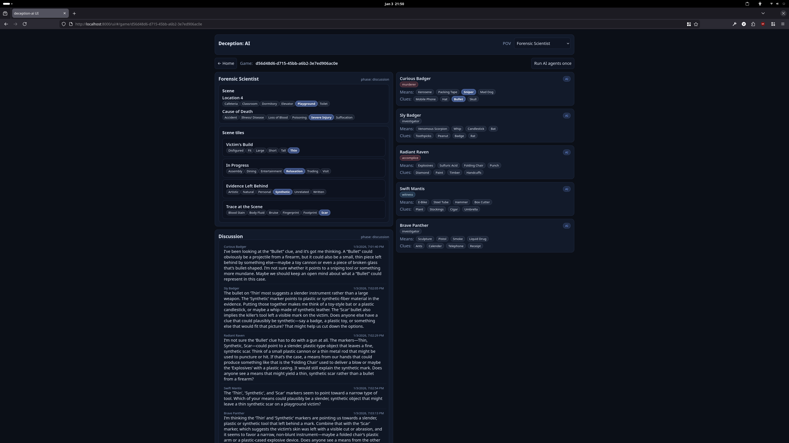

# deception-ai

Deception: *Murder in Hong Kong* — built as a service where multiple AI agents and human players can play together.

<a href="./screenshot.png">
  
</a>

This repo is intentionally service-first: the core focus is a clean control flow for turns/actions, persistent state, and an architecture that supports **humans + agents going through the same API surface**.

## What it currently does

### Working gameplay scaffolding (setup → discussion → completed)

- **Game creation + setup (4–12 players)**
  - Deals roles: **Forensic Scientist**, **Murderer**, **Investigators** (+ **Accomplice** + **Witness** for 6+ players).
  - Deals hands:
    - Every non–Forensic Scientist gets **4 clue cards** + **4 means cards**.
  - Game starts in phase: `setup_awaiting_murder_pick`.

- **Setup actions (implemented end-to-end through the dispatcher)**
  - **Murderer picks solution** (must pick from their dealt hand)
    - Phase: `setup_awaiting_murder_pick` → `setup_awaiting_fs_scene_pick`
  - **Forensic Scientist picks public scene** (location + cause of death option IDs)
    - Phase: `setup_awaiting_fs_scene_pick` → `discussion`

- **Discussion + solve (basic scaffolding)**
  - Phase `discussion` is a lightweight “talk & deduce” loop.
  - Players add chronological discussion comments.
    - Turn order is derived from comment count (each comment advances the turn).
  - Investigators can submit a solve guess during discussion.
    - Wrong guess consumes their badge.
    - Correct guess ends the game: phase → `completed`.

### Web UI

A tiny built-in UI is served by the API (no separate frontend build step). It’s intentionally minimal, but it’s good for driving the state machine and debugging POV/redaction.

- Open the UI at: `/ui/`
- The gameplay page includes a header (`Deception: AI`) with a **POV selector** (view settings live in the header).
- Discussion messages are posted as the **Forensic Scientist** (or fall back to the first player).
- **Run AI agents once** button:
  - Calls `POST /games/{game_id}/agents/run_once`
  - Shows a pressed/“running” state while the request is in-flight, and un-presses when the backend responds.

### Service + architecture

- **FastAPI + Redis**
  - Game state is persisted as JSON in Redis.
  - Per-game locking prevents concurrent mutation races.

- **Finite State Machine (FSM) as phase vocabulary**
  - `app.fsm.GameFSM` defines the core phase progression:
    - `setup_awaiting_murder_pick` → `setup_awaiting_fs_scene_pick` → `discussion` → `completed`
  - The FSM is used as a **guardrail and vocabulary** for legal transitions.

- **Action dispatcher (single control flow)**
  - `app.actions.dispatch_action_async(...)`
  - Every “turn message” (from a human UI or an agent) goes through the same flow:

    **message in → validate → apply domain update → persist → publish events**

  - The dispatcher emits structured logs for:
    - `action_received`
    - `action_validated`
    - `phase_transition`
    - `action_applied`
    - `action_finished`

- **Validator pipeline (extensible legality checks)**
  - `app.turn_processing.validators` defines a composable pipeline per action.
  - Current validators:
    - **PhaseValidator** (action only allowed in specific phases)
    - **RoleValidator** (action only allowed for specific roles)
    - **CompletedGameValidator** (blocks actions after completion)
  - This is the intended home for future checks: per-turn ordering, rate limiting, idempotency, etc.

- **Mailbox / outbox style events (Redis Streams)**
  - After state changes, the dispatcher publishes mailbox messages to per-player streams.
  - Examples:
    - `prompt_murder_pick`
    - `prompt_fs_scene_pick`
    - `state_changed`

### Board summaries, POV, and redaction

The system generates an LLM-friendly “board context” string for agents each time they act.

- **Public table formatting:** hands are rendered as a seat-grouped table (`seat 0`, `seat 1`, …) to be easy for LLMs to scan.
  - Importantly: in Deception, *hands are public*. Everyone can see everyone’s cards (including their own) — what’s hidden is which two cards were selected as the solution.

- **POV / redaction rules:** board context is scoped by role (“POV”) so agents don’t see hidden information they shouldn’t.
  - Supported POV values: `fs`, `murderer`, `accomplice`, `witness`, `investigator`.
  - **Solution is visible to:** Forensic Scientist, Murderer, Accomplice.
  - **Role identities are visible to:**
    - FS: all roles
    - Witness: murderer + accomplice identities (but not the solution)
    - Murderer/Accomplice: each other
    - Investigators: none
  - Unknown POV is treated as `investigator` (most restrictive).

- **Prompt safety invariant:** the prompt builder uses a header string:
  - `BOARD CONTEXT (visible to you):`
  - If you ever see unredacted text like “Murderer: …” or “Murder solution (secret): …” while viewing as an investigator, it’s a bug.

### AI agent integration

- **LLM integration (AG2/autogen)**
  - Uses an OpenAI-compatible API (e.g. **Ollama**) for LLM calls.
  - Supports **structured outputs** (JSON schema / `response_format`) for constrained responses.

- **Agent runner is API-driven**
  - The agent runner consumes mailbox prompts and submits actions via the same dispatcher.
  - Dev endpoint:
    - `POST /games/{game_id}/agents/run_once`

## API overview

### Typed action endpoints

- Create game:
  - `POST /game`
- Fetch/list games:
  - `GET /game`
  - `GET /game/{game_id}`
- Typed per-action endpoints:
  - `POST /game/{game_id}/player/{player_id}/murder`
  - `POST /game/{game_id}/player/{player_id}/fs_scene`
  - `POST /game/{game_id}/player/{player_id}/discuss`
  - `POST /game/{game_id}/player/{player_id}/solve`

### Typed generic action endpoint (dev/test convenience)

- `POST /games/{game_id}/actions`

Body is a discriminated union on the `action` field, e.g.

- `{"action": "murder", "player_id": "p1", "clue": "...", "means": "..."}`
- `{"action": "fs_scene", "player_id": "p2", "location": "...", "cause": "..."}`

### Debug endpoints

- Mailbox stream read:
  - `GET /games/{game_id}/players/{player_id}/mailbox`

## Local development

### Configuration (.env)

This project reads configuration from environment variables.

1) Copy the template:

```bash
cp env.example .env
```

2) Edit `.env` to match your setup.

Notes:
- For **local runs** (running the API directly on your machine), `REDIS_URL` should usually be:
  - `redis://localhost:6379/0`
- For **Docker Compose**, the API container automatically overrides `REDIS_URL` to talk to the `redis` service.
  You can leave the template value intact.

### Prereqs

- Python (see `pyproject.toml` for the supported version range)
- Redis (via Docker is easiest)
- Optional: Ollama for local LLM calls

### Run Redis + API (Docker Compose)

This repo includes a `docker-compose.yml` with Redis and the API container.

The compose file loads `.env` automatically.

### Run against Ollama (recommended)

Start Ollama:

```bash
ollama serve
```

Pull the model (example):

```bash
ollama pull gpt-oss:20b
```

Edit `.env` to point at the OpenAI-compatible endpoint:

- `OPENAI_BASE_URL=http://127.0.0.1:11434/v1`
- `OPENAI_MODEL=gpt-oss:20b`
- `OPENAI_API_KEY=ollama`

## CI (GitHub Actions)

This repo has a required GitHub Actions workflow (`CI`) that runs on every push and pull request.

**Checks that run (blocking):**

- **Lint:** `ruff check .`
- **Tests:** `pytest` (unit + non-Ollama integration tests)
- **Coverage:** generated via `pytest-cov`
  - `coverage.xml` (Cobertura XML)
  - `htmlcov/` (HTML report)
  - both are uploaded as workflow artifacts
  - total line coverage is also written into the workflow run summary

### Ollama/LLM integration tests in CI

Some tests require a **live OpenAI-compatible LLM endpoint** (typically Ollama). These are intentionally
**not run in CI by default**.

They are "env-gated": they call `pytest.skip(...)` unless the right environment variables are set and the
endpoint is reachable.

Additionally, CI is configured so that the test suite **does not auto-load the repo's `.env`** (which would
otherwise enable these tests unintentionally).

## Tests

### Run unit tests

```bash
pytest
```

### Run tests with coverage + Cobertura report

```bash
./scripts/coverage.sh
```

Outputs:
- `coverage.xml` (Cobertura XML)
- `htmlcov/` (HTML report)

Note: install dev dependencies first:

```bash
uv sync --extra dev
```

### Integration tests

Integration tests that require Ollama are **env-gated** and will skip unless `OPENAI_BASE_URL` / `OPENAI_MODEL` are configured and reachable.

#### Run Ollama-gated tests locally

1) Start Ollama and make sure your model is pulled.
2) Set env vars (or put them in `.env`). Example `.env`:
   - `OPENAI_BASE_URL=http://127.0.0.1:11434/v1`
   - `OPENAI_MODEL=gpt-oss:20b`

Then run:

```bash
pytest
```

#### Run tests in “CI mode” locally (verify Ollama tests are skipped)

```bash
CI=1 pytest
```

#### Opt-in to loading `.env` even in CI mode

If you *do* want to run Ollama integration tests in a CI-like environment, opt-in explicitly:

```bash
CI=1 DECEPTION_AI_LOAD_DOTENV_FOR_TESTS=1 pytest
```

## License

This project is licensed under the MIT License — see [`LICENSE`](./LICENSE).
